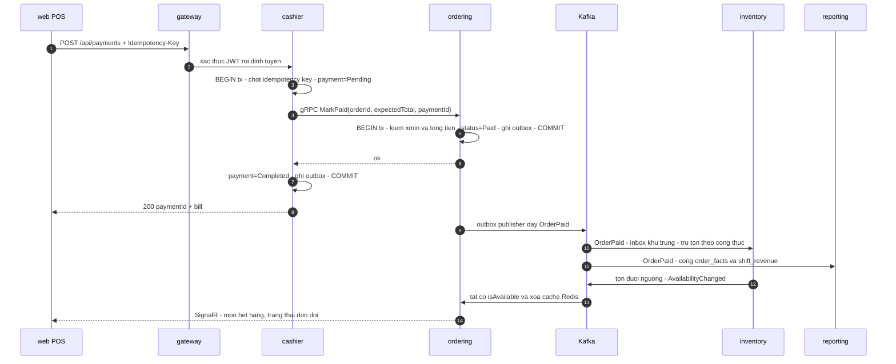

# Spec: Hệ thống F&B microservices làm hiện vật phỏng vấn

> Sinh từ [intent.md](./intent.md) dưới ràng buộc của [AGENTS.md](../../../AGENTS.md).
> Mọi quyết định kỹ thuật ở đây phải truy ngược được về một tiêu chí chấp nhận trong intent.

> ⚠️ **Hai rào cản còn rỗng.** `AGENTS.md` và `docs/architecture/STRUCTURE.md` hiện vẫn là
> bản mẫu chưa điền; `docs/database/schema.md`, `docs/api/endpoints.md`,
> `docs/design/DESIGN_SYSTEM.md` chưa tồn tại. Spec này vì vậy **tự định nghĩa** nền tảng
> (mục 3, 4, 6) và đề xuất nội dung cho các file đó ở mục 12. Con người chốt `AGENTS.md`
> trước khi `/sdlc:build` chạy — Agent không được tự ghi file đó.

## 1. Tóm tắt giải pháp

Dựng mới hai workspace: `backend/` (một solution .NET 10, năm dịch vụ + một API Gateway) và
`web/` (SPA React + Vite). Mỗi dịch vụ sở hữu **một ranh giới nhất quán riêng** và một database
riêng trong cùng một máy PostgreSQL; không dịch vụ nào đọc bảng của dịch vụ khác.

Giao tiếp có hai kiểu, mỗi kiểu chỉ dùng ở chỗ nó là câu trả lời đúng: **Kafka** cho mọi việc
chịu được nhất quán cuối (trừ kho, dựng báo cáo, phát tình trạng ca), **gRPC** cho đúng một
đường đồng bộ không được đọc số cũ (lúc thu tiền phải đọc tổng tiền đơn hàng ngay tại thời
điểm đó). Độ bền của sự kiện do **transactional outbox** ở bên gửi và **inbox khử trùng** ở
bên nhận bảo đảm — đây chính là câu trả lời cho trường hợp biên "dịch vụ chết giữa đường".

Realtime bếp ↔ thu ngân dùng **SignalR** (có sẵn trong ASP.NET Core, không thêm phụ thuộc),
không dùng polling: polling 2 giây cũng đạt tiêu chí nhưng là câu trả lời yếu khi bị đào.

Việc này `size: L` nên được chia **bốn lát giao hàng tuần tự** (mục 11), mỗi lát tự chạy được.

## 2. Phạm vi ảnh hưởng

| Workspace | Có đổi? | Nội dung |
|-----------|---------|----------|
| `backend` | **Tạo mới** | Solution .NET 10: `gateway`, `identity`, `ordering`, `cashier`, `inventory`, `reporting` + 2 project dùng chung + test |
| `web` | **Tạo mới** | SPA React 19 + Vite: đăng nhập, POS, màn bếp, thu tiền/chốt ca, tồn kho, báo cáo |
| `docs` | Có | `architecture/STRUCTURE.md`, `database/schema.md`, `api/endpoints.md`, `design/DESIGN_SYSTEM.md`, `README.md` (bảng đối chiếu JD) |
| hạ tầng local | Tạo mới | `docker-compose.yml`: PostgreSQL, Kafka (KRaft, không ZooKeeper), Redis + 6 container ứng dụng |

### Vì sao đúng năm dịch vụ, không nhiều hơn

| Dịch vụ | Cổng | Ranh giới nó sở hữu | Vì sao không gộp |
|---------|------|---------------------|------------------|
| `identity` | 8081 | Người dùng, vai, phát/thu hồi token | Ranh giới tin cậy riêng; bị gộp là mọi dịch vụ đều chạm bảng user |
| `ordering` | 8082 | Thực đơn, đơn hàng, vòng đời món, màn bếp | Ghi nhiều, tương tranh cao — nơi duy nhất cần chống ghi đè |
| `cashier` | 8083 | Ca làm việc, thanh toán, đối chiếu tiền | Ranh giới tiền: bắt buộc transaction + idempotency, tách để không bị code đơn hàng làm bẩn |
| `inventory` | 8084 | Nguyên liệu, công thức, tồn, ngưỡng cảnh báo | Nhất quán cuối là **đúng** ở đây; gộp vào đơn hàng là tự nhốt mình vào transaction phân tán |
| `reporting` | 8085 | Read model doanh thu theo ca/ngày | Đọc nhiều ghi không — mặt Query của CQRS, tách để scale và để không join qua database khác |
| `gateway` | 8080 | Một cửa vào duy nhất, xác thực JWT, định tuyến, WebSocket | — |

**Cố ý KHÔNG có:** dịch vụ `menu` riêng (thực đơn là dữ liệu tham chiếu đọc-nhiều của luồng
đặt món, để trong `ordering`), dịch vụ `notification` (chưa có kênh gửi ra ngoài nào),
multi-tenant, và bất cứ thứ gì ở mục "Ngoài phạm vi" của intent.

## 3. Thay đổi dữ liệu

Một container PostgreSQL, **mỗi dịch vụ một database**: `fnb_identity`, `fnb_ordering`,
`fnb_cashier`, `fnb_inventory`, `fnb_reporting`. Không có connection string nào trỏ sang
database của dịch vụ khác. Migration bằng EF Core, chạy lúc khởi động khi
`ASPNETCORE_ENVIRONMENT=Development` (AGENTS.md §3.6: chỉ database dev).

**Tiền:** đơn vị VND, kiểu `decimal(18,2)` ở DB và `decimal` trong C#. Không `float`/`double`
ở bất kỳ đâu có chữ "tiền".
**Thời gian:** `timestamptz`, lưu UTC, đổi sang giờ Việt Nam ở tầng hiển thị.
**Tương tranh:** dùng cột hệ thống `xmin` của PostgreSQL làm concurrency token
(`.UseXminAsConcurrencyToken()`) — không thêm cột `version` thủ công.

### `fnb_ordering`

| Bảng | Trường chính | Index | Ghi chú |
|------|--------------|-------|---------|
| `menu_items` | `id`, `name`, `price`, `is_active`, `is_available` | `(is_active)` | `is_available` là hình chiếu do sự kiện từ `inventory` cập nhật, **không** do người dùng sửa |
| `orders` | `id`, `code`, `shift_id`, `status`, `total`, `created_at`, `paid_at`, `paid_payment_id` | `(shift_id)`, `(status)`, unique `(code)` | `status`: `Open`→`Paid`/`Cancelled`; `paid_payment_id` unique-nullable để `MarkPaid` idempotent |
| `order_items` | `id`, `order_id`, `menu_item_id`, `name_snapshot`, `unit_price`, `qty`, `status` | `(order_id)` | `status`: `Pending`→`Preparing`→`Done`/`Cancelled`. Giá và tên **chụp lại** lúc gọi món |
| `current_shift` | `shift_id`, `opened_at` (0-1 dòng) | — | Hình chiếu từ sự kiện `ShiftOpened`/`ShiftClosed` của `cashier` |
| `outbox_messages` | `id`, `type`, `payload`, `occurred_at`, `published_at` | `(published_at)` where null | Ghi cùng transaction nghiệp vụ |
| `inbox_messages` | `message_id`, `handled_at` | pk `(message_id)` | Khử sự kiện trùng |

### `fnb_cashier`

| Bảng | Trường chính | Index | Ghi chú |
|------|--------------|-------|---------|
| `shifts` | `id`, `opened_by`, `opened_at`, `closed_at`, `opening_float`, `counted_cash`, `expected_cash`, `variance` | unique partial `(closed_at) where closed_at is null` | **Chỉ một ca mở tại một thời điểm** — ràng buộc ở DB, không ở code |
| `payments` | `id`, `order_id`, `shift_id`, `amount`, `method`, `status`, `created_at` | unique `(order_id) where status='Completed'` | `method`: `Cash`/`Transfer`; `status`: `Pending`→`Completed`/`Failed` |
| `idempotency_keys` | `key`, `endpoint`, `request_hash`, `response_status`, `response_body`, `created_at` | pk `(key, endpoint)` | Gửi lại cùng key → trả nguyên phản hồi cũ |
| `outbox_messages` / `inbox_messages` | như trên | | |

### `fnb_inventory`

| Bảng | Trường chính | Index | Ghi chú |
|------|--------------|-------|---------|
| `ingredients` | `id`, `name`, `unit`, `on_hand`, `low_threshold` | — | `on_hand` kiểu `decimal(18,3)` (gram/ml) |
| `recipe_lines` | `menu_item_id`, `ingredient_id`, `qty_per_unit` | pk cặp | Công thức: 1 ly cà phê sữa = 18g cà phê + 40ml sữa |
| `stock_movements` | `id`, `ingredient_id`, `delta`, `reason`, `ref_id`, `created_at` | `(ingredient_id, created_at)`, unique `(reason, ref_id, ingredient_id)` | Sổ cái tồn kho, chỉ ghi thêm; unique chặn trừ hai lần cho cùng một đơn |
| `outbox_messages` / `inbox_messages` | như trên | | |

### `fnb_reporting`

| Bảng | Trường chính | Index | Ghi chú |
|------|--------------|-------|---------|
| `shift_revenue` | `shift_id`, `opened_at`, `closed_at`, `order_count`, `gross`, `cash_total`, `transfer_total`, `variance` | `(closed_at)` | Read model, dựng từ sự kiện — **không** join sang database khác |
| `order_facts` | `order_id`, `shift_id`, `paid_at`, `total`, `item_count` | `(shift_id)`, `(paid_at)` | Nguồn cho bảng báo cáo có phân trang |
| `inbox_messages` | như trên | | |

### `fnb_identity`

| Bảng | Trường chính | Ghi chú |
|------|--------------|---------|
| `users` | `id`, `username` (unique), `password_hash`, `role`, `is_active` | Hash bằng `PasswordHasher<T>` của ASP.NET Core (PBKDF2), không tự viết |
| `refresh_tokens` | `id`, `user_id`, `token_hash`, `expires_at`, `revoked_at`, `replaced_by` | Lưu **hash**, không lưu token thô; rotate mỗi lần dùng |

### Di trú dữ liệu

Không cần: dự án greenfield, chưa có dữ liệu cũ. Dữ liệu demo do lệnh seed riêng nạp
(`dotnet run --project backend/tools/Seeder`), không nhét vào migration — để môi trường sạch
vẫn sạch.

## 4. Hợp đồng API

Mọi thứ đi qua gateway `http://localhost:8080`. **Mặc định mọi endpoint yêu cầu JWT
(`[Authorize]` qua `FallbackPolicy`)**; endpoint public phải ghi lý do ngay tại chỗ.
Validation bằng DataAnnotations trên DTO + `[ApiController]` (tự trả `400 ProblemDetails`) —
không dịch vụ nào nhận `object`/`dynamic`, không endpoint nào tự parse body.

Lỗi trả theo `ProblemDetails`, trường `detail` là **câu tiếng Việt hướng người dùng**.

### `POST /api/auth/login` — public (chưa có token thì không thể có token)

```csharp
public sealed record LoginRequest(
    [Required, StringLength(50, MinimumLength = 3)] string Username,
    [Required, StringLength(100, MinimumLength = 8)] string Password);
```

- **Response:** `{ "accessToken": "...", "refreshToken": "...", "role": "Cashier", "expiresIn": 3600 }`
- Access token 60 phút; refresh token 12 giờ, rotate mỗi lần dùng, lưu dạng hash, thu hồi được.

| HTTP | Khi nào | Thông báo cho người dùng |
|------|---------|--------------------------|
| 401 | Sai tài khoản hoặc mật khẩu | "Tên đăng nhập hoặc mật khẩu không đúng." |
| 423 | Sai quá 10 lần trong 15 phút | "Tài khoản tạm khoá 15 phút vì đăng nhập sai quá nhiều lần." |

Không bao giờ phân biệt "sai mật khẩu" với "không có tài khoản" (chống dò tài khoản).

### `POST /api/auth/refresh` — public (dùng refresh token thay cho access token)

Token đã dùng rồi mà gửi lại → `401` + thu hồi cả chuỗi token của người đó (dấu hiệu bị trộm).

### `GET /api/menu` — `Cashier`, `Owner`

Trả thực đơn kèm `isAvailable`. Cache Redis 60 giây, key `menu:v1`, bị xoá ngay khi nhận sự
kiện `AvailabilityChanged` — đây là lý do Redis tồn tại trong hệ thống này.

### `POST /api/orders` — `Cashier`

```csharp
public sealed record CreateOrderRequest(
    [Required, MinLength(1), MaxLength(100)] List<OrderLineRequest> Items);

public sealed record OrderLineRequest(
    [Required] Guid MenuItemId,
    [Range(1, 99)] int Qty);
```

| HTTP | Khi nào | Thông báo cho người dùng |
|------|---------|--------------------------|
| 409 | Chưa mở ca | "Chưa mở ca làm việc. Mở ca trước khi nhận đơn." |
| 409 | Món vừa hết | "Món {tên} vừa hết hàng, vui lòng bỏ khỏi đơn." |
| 503 | Không kết nối được (phía web đã tự chặn trước) | "Mất kết nối tới hệ thống. Không thể tạo đơn lúc này." |

### `POST /api/orders/{id}/items` · `DELETE /api/orders/{id}/items/{itemId}` — `Cashier`

Huỷ món chỉ được khi món còn `Pending`. Món đã `Preparing`/`Done` → `409` "Món này bếp đã làm,
cần bếp xác nhận mới huỷ được." Huỷ cả đơn chỉ được khi đơn còn `Open`.

Mọi lệnh ghi lên đơn nhận header `If-Match: <version>`; lệch version → `409` "Đơn vừa được
người khác cập nhật. Tải lại rồi thử lại nhé."

### `PATCH /api/orders/{id}/items/{itemId}/status` — `Kitchen`

Chuyển `Pending`→`Preparing`→`Done`. Thu ngân và bếp sửa hai trường khác nhau nhưng vẫn trên
cùng một dòng dữ liệu, nên vẫn qua cùng cơ chế `xmin`.

### `POST /api/shifts/open` · `POST /api/shifts/{id}/close` — `Cashier`, `Owner`

`close` nhận `countedCash`, trả `expectedCash` và `variance`. Mở ca thứ hai khi còn ca đang mở
→ `409` "Đang có ca mở. Đóng ca hiện tại trước."

### `POST /api/payments` — `Cashier` — **bắt buộc** header `Idempotency-Key`

```csharp
public sealed record CreatePaymentRequest(
    [Required] Guid OrderId,
    [Required, Range(0.01, 1_000_000_000)] decimal ExpectedTotal,
    [Required] PaymentMethod Method);
```

| HTTP | Khi nào | Thông báo cho người dùng |
|------|---------|--------------------------|
| 400 | Thiếu `Idempotency-Key` | "Yêu cầu không hợp lệ." (chi tiết chỉ log phía server) |
| 409 | `ExpectedTotal` lệch tổng thật của đơn | "Đơn vừa thay đổi, tổng tiền hiện tại là {x}. Kiểm tra lại rồi thu tiền." |
| 409 | Đơn đã thanh toán bởi payment khác | "Đơn này đã được thanh toán." |
| 409 | Chưa mở ca | "Chưa mở ca làm việc." |
| 422 | Cùng key nhưng body khác lần trước | "Yêu cầu không khớp với lần gửi trước." |

Gửi lại **cùng** `Idempotency-Key` với cùng body → trả đúng phản hồi lần đầu, không tạo bút
toán thứ hai (tiêu chí #5).

### `GET /api/reports/shifts?from=&to=&sort=&page=&pageSize=` — `Owner`

Query params là hợp đồng công khai, vì frontend đặt nguồn chân lý ở URL: `from`/`to` ISO date,
`sort` ∈ `{openedAt, gross, orderCount}` kèm tiền tố `-` cho giảm dần, `page` ≥ 1,
`pageSize` ∈ `{20, 50, 100}`. Param sai → `400` nêu rõ param nào sai.

### `GET /api/inventory/ingredients` — `Owner` · `GET /healthz` — public (probe hạ tầng)

### gRPC nội bộ (không ra khỏi mạng Docker)

`Ordering.MarkPaid(orderId, expectedTotal, paymentId)` → `ok` | `totalMismatch(actual)` |
`alreadyPaid`. Đây là **đường đồng bộ duy nhất**, tồn tại vì đọc tổng tiền cũ để thu tiền là
sai tiền.

### Sự kiện Kafka

| Topic | Bên phát | Bên nhận | Dùng để |
|-------|----------|----------|---------|
| `fnb.ordering.order-paid.v1` | ordering | inventory, reporting | Trừ kho, dựng doanh thu |
| `fnb.ordering.order-cancelled.v1` | ordering | reporting | Loại đơn huỷ khỏi báo cáo |
| `fnb.cashier.shift-opened.v1` / `shift-closed.v1` | cashier | ordering, reporting | Ca hiện hành, chốt báo cáo ca |
| `fnb.inventory.availability-changed.v1` | inventory | ordering | Bật/tắt cờ hết hàng của món |
| `fnb.inventory.stock-deduction-failed.v1` | inventory | reporting | Cảnh báo lệch tồn cho chủ quán |

Key = `orderId`/`shiftId` (giữ thứ tự theo đơn trong cùng partition). Mỗi message có `messageId`
để bên nhận khử trùng qua `inbox_messages`. Consumer commit offset **sau** khi transaction
nghiệp vụ commit — at-least-once cộng inbox cho ra hiệu ứng exactly-once.

## 5. Luồng xử lý



**Dịch vụ chết giữa đường.** Nếu `inventory` sập sau khi `OrderPaid` đã lên Kafka, offset chưa
commit nên khi sống lại nó nhận lại sự kiện; `inbox_messages` cộng unique
`(reason, ref_id, ingredient_id)` trên `stock_movements` chặn trừ hai lần. Nếu `ordering` sập
sau khi commit mà chưa publish, outbox publisher đẩy nốt lúc khởi động. Không bước nào mất việc.

**Bán rồi mà kho không đủ.** Không rollback đơn đã thu tiền — thực tế khách đã cầm ly cà phê.
`inventory` cho tồn về âm, ghi `stock_movements` với `reason='oversold'` và phát
`StockDeductionFailed` để chủ quán thấy lệch. Đây là quyết định nghiệp vụ, ghi ở đây để không
ai "sửa" thành rollback.

## 6. Giao diện

React 19 + Vite + TypeScript. Router/Query/Table/Form của TanStack, Zod, Zustand,
shadcn/ui + Tailwind v4 (`@import "tailwindcss"`, **không** tạo `tailwind.config.js`).

| Màn hình | Route | Component chính | Trạng thái cần xử lý |
|----------|-------|-----------------|----------------------|
| Đăng nhập | `/login` | `LoginForm` (TanStack Form + Zod) | loading / lỗi 401 / khoá 423 |
| POS đặt món | `/pos` | `MenuGrid`, `OrderPanel` | loading / thực đơn rỗng / mất kết nối / món hết hàng |
| Màn bếp | `/kitchen` | `KitchenBoard` (SignalR) | chưa có đơn nào / mất kết nối / đơn vừa bị huỷ |
| Thu tiền & chốt ca | `/shift` | `PaymentDialog`, `CloseShiftForm` | chưa mở ca / đang thu tiền / lệch tổng tiền / lệch tiền đếm |
| Tồn kho | `/inventory` | `IngredientTable` (TanStack Table) | rỗng / dưới ngưỡng (highlight) |
| Báo cáo ca | `/reports/shifts` | `ShiftReportTable` | rỗng / đang tải / param URL sai |

**Quy ước bắt buộc:**

- Search params của `/reports/shifts` và `/inventory` parse bằng **Zod schema** trong
  `validateSearch` của route — đây là nguồn chân lý duy nhất cho filter/sort/paging, không
  `useState` nào giữ mấy giá trị này (tiêu chí #10).
- Server state chỉ qua TanStack Query; query key sinh từ **một** query key factory
  (`src/lib/queryKeys.ts`); `staleTime` mặc định 30s đặt ở `QueryClient`.
- Zustand **chỉ** giữ UI state (sidebar, theme, dialog đang mở). Không cache dữ liệu API ở đó.
- Gọi API qua một client duy nhất (`src/lib/apiClient.ts`) — không `fetch` rải rác trong
  component. Client tự đính JWT, tự refresh khi 401, tự sinh `Idempotency-Key` cho mutation
  thanh toán.
- Mất kết nối: `onlineManager` của TanStack Query cộng ping `/healthz` mỗi 10s → banner đỏ
  "Mất kết nối tới hệ thống" và **disable** nút tạo đơn/thu tiền. Có mạng lại thì Query tự
  refetch, không cần F5 (trường hợp biên #1).
- React Compiler bật trong `vite.config.ts`; không rải `useMemo`/`useCallback` thủ công, trừ
  `data`/`columns` của TanStack Table (thư viện đòi tham chiếu ổn định).
- Không tự sáng tác token màu/spacing: dùng biến CSS của shadcn/ui, khai báo trong
  `docs/design/DESIGN_SYSTEM.md` (mục 12).

## 7. Tính toàn vẹn & tương tranh

| Thao tác | Cơ chế | Vì sao đủ | Test chứng minh |
|----------|--------|-----------|-----------------|
| Thu tiền một đơn | `idempotency_keys` (pk) + unique `(order_id) where status='Completed'` + `MarkPaid` mang `paymentId` | Hai request song song: một thắng, một nhận lại đúng phản hồi cũ. DB chốt, không phải if-else trong code | `Payments_ConcurrentSameKey_CreatesOneLedgerEntry` |
| Thu tiền khi đơn vừa đổi | So `expectedTotal` với tổng thật trong cùng transaction của `ordering` | Không thu sai số tiền đã hiển thị cho khách | `MarkPaid_TotalMismatch_Returns409` |
| Hai người sửa cùng đơn | `xmin` làm concurrency token + `If-Match` từ client | Ghi trên bản cũ bị từ chối chứ không đè mất | `Order_ConcurrentUpdate_SecondWriterGets409` |
| Chỉ một ca mở | unique partial index `(closed_at) where closed_at is null` | Race hai người mở ca cùng lúc bị DB chặn | `OpenShift_Concurrent_OnlyOneSucceeds` |
| Trừ kho theo đơn | inbox khử trùng + unique `(reason, ref_id, ingredient_id)` + một transaction cho cả nhóm nguyên liệu | Sự kiện lặp không trừ hai lần; trừ nửa vời không tồn tại | `StockDeduction_DuplicateEvent_DeductsOnce` |
| Phát sự kiện sau khi commit | outbox trong cùng transaction nghiệp vụ + publisher riêng | Không có cảnh "đã đổi DB mà mất sự kiện" và ngược lại | `Outbox_CrashBeforePublish_PublishesOnRestart` |
| Doanh thu ca đêm | `orders.shift_id` gán lúc tạo đơn từ `current_shift`; báo cáo group theo `shift_id`, **không** theo ngày lịch | Đơn 01:30 thuộc ca mở 18:00; trong code không tồn tại phép cắt nửa đêm nào | `ShiftRevenue_OrderAfterMidnight_BelongsToOpeningShift` |

Năm test đầu tiên ghi vào `sdlc.config.json → requiredTests`: chúng là câu trả lời cho các câu
hỏi phỏng vấn, không được "dọn dẹp" mất.

## 8. Rủi ro bảo mật

| Rủi ro | Mức | Giảm thiểu |
|--------|-----|------------|
| Secret trong repo (connection string, JWT key) | Cao | Chỉ qua biến môi trường và `.env` (đã trong `.gitignore`); cập nhật `.env.example`. Compose đọc từ `.env`, không hardcode |
| JWT key yếu, token không thu hồi được | Cao | Key ≥ 32 byte từ env; access 60 phút; refresh rotate, lưu hash, thu hồi được. Gateway và từng dịch vụ đều validate issuer/audience/lifetime |
| Dịch vụ nội bộ bị gọi trực tiếp, bỏ qua gateway | Cao | Chỉ gateway publish cổng ra host; năm dịch vụ nằm trong network nội bộ và **vẫn** tự validate JWT (không tin gateway vô điều kiện) |
| Endpoint mới quên phân quyền | Trung bình | `[Authorize]` là mặc định qua `FallbackPolicy`; muốn public phải viết `[AllowAnonymous]` tường minh — eval grep được |
| CORS mở `*` | Trung bình | Origin đọc từ env, mặc định chỉ `http://localhost:5173` |
| Log lộ dữ liệu định danh | Trung bình | Không log `password`, `passwordHash`, `accessToken`, `refreshToken`, `Idempotency-Key`; middleware log theo allowlist trường |
| Dò mật khẩu | Trung bình | Khoá 15 phút sau 10 lần sai; thông báo lỗi không phân biệt nguyên nhân |
| Seeder tạo user mật khẩu mặc định | Trung bình | Chỉ chạy khi `ASPNETCORE_ENVIRONMENT=Development`; mật khẩu demo đọc từ env, in ra console lúc seed, ghi rõ trong README là dữ liệu demo |

### Phụ thuộc mới (người điều phối quyết ở bước plan)

| Gói | Vì sao không tự viết |
|-----|----------------------|
| `Npgsql.EntityFrameworkCore.PostgreSQL` | Provider EF Core cho PostgreSQL |
| `Confluent.Kafka` | Client Kafka chính thức |
| `Microsoft.Extensions.Caching.StackExchangeRedis` | Cache Redis qua `IDistributedCache` |
| `Microsoft.AspNetCore.Authentication.JwtBearer` | Validate JWT |
| `Yarp.ReverseProxy` | Gateway; hỗ trợ WebSocket sẵn cho SignalR |
| `Grpc.AspNetCore`, `Grpc.Net.ClientFactory` | Đường đồng bộ nội bộ |
| `xunit`, `FluentAssertions`, `Testcontainers.PostgreSql`, `Testcontainers.Kafka` | Integration test trên hạ tầng thật, không mock cái đang test |
| web: `@tanstack/react-{router,query,table,form}`, `zod`, `zustand`, `tailwindcss`, shadcn/ui (copy vào repo), `@microsoft/signalr`, `vitest`, `@playwright/test` | Đúng stack người khởi xướng chỉ định |

**Cố ý KHÔNG thêm:** MediatR (v13 là bản thương mại — handler inject trực tiếp vào controller,
cross-cutting dùng decorator), AutoMapper (mapping tay ngắn hơn và đọc được), FluentValidation
(DataAnnotations có sẵn và đủ), MassTransit (che mất đúng phần Kafka cần cho thấy), Serilog
(logging có sẵn của .NET đủ cho môi trường local).

## 9. Chiến lược kiểm thử

| Loại | File | Ca kiểm thử |
|------|------|-------------|
| Unit | `backend/tests/Ordering.UnitTests/OrderTests.cs` | Tổng tiền; huỷ món theo trạng thái; chặn tạo đơn khi chưa mở ca |
| Unit | `backend/tests/Cashier.UnitTests/ShiftTests.cs` | `expectedCash` = float đầu ca + tiền mặt trong ca; `variance` khi đếm lệch |
| Unit | `backend/tests/Inventory.UnitTests/RecipeTests.cs` | 2 ly cà phê sữa → 36g cà phê + 80ml sữa; qua ngưỡng thì phát sự kiện |
| Integration | `backend/tests/Cashier.IntegrationTests/PaymentIdempotencyTests.cs` | 5 request song song cùng `Idempotency-Key` → 1 bút toán |
| Integration | `backend/tests/Ordering.IntegrationTests/ConcurrencyTests.cs` | Hai writer trên cùng đơn → writer sau nhận 409 |
| Integration | `backend/tests/Inventory.IntegrationTests/StockDeductionTests.cs` | Sự kiện `OrderPaid` gửi 3 lần → trừ kho đúng 1 lần |
| Integration | `backend/tests/Ordering.IntegrationTests/OutboxTests.cs` | Chết trước khi publish → khởi động lại vẫn phát đủ, không phát trùng |
| Integration | `backend/tests/Reporting.IntegrationTests/NightShiftTests.cs` | Đơn 01:30 thuộc ca mở 18:00 hôm trước |
| Integration | `backend/tests/Identity.IntegrationTests/AuthTests.cs` | Sai 10 lần → 423; refresh token dùng lại lần hai → bị từ chối và thu hồi chuỗi |
| Unit (web) | `web/src/routes/reports/__tests__/searchSchema.test.ts` | Zod parse search params: mặc định, param rác, `pageSize` ngoài danh sách |
| E2E | `web/e2e/order-to-payment.spec.ts` | Đăng nhập → mở ca → 3 món → bếp thấy ≤2s → đánh dấu xong → thu tiền → đóng ca |
| E2E | `web/e2e/offline-banner.spec.ts` | Chặn mạng → banner hiện, nút tạo đơn disable → mở lại mạng → tự hồi phục, không F5 |
| E2E | `web/e2e/report-url-state.spec.ts` | Đổi filter/sort/trang → URL đổi; mở URL đó ở context mới → ra đúng kết quả |
| Thủ công (có ảnh chụp) | `docs/evidence/01-260925-fnb-pos-core/` | 4 luồng: đặt món, thanh toán, trừ kho, chốt ca, kèm ảnh `docker compose ps` |

Hiệu năng (tiêu chí #2, #3, #4) đo bằng mốc thời gian trong Playwright, ngưỡng cứng 2000ms —
không đo bằng cảm nhận.

## 10. Ánh xạ về tiêu chí chấp nhận

| Tiêu chí trong intent.md | Được đáp ứng bởi | Được chứng minh bởi |
|---|---|---|
| 1. Một lệnh dựng + một lệnh seed | `docker-compose.yml` (9 container) + `backend/tools/Seeder` | Ảnh `docker compose ps` + log seed trong `docs/evidence/` |
| 2. Đơn 3 món → bếp ≤2s | SignalR hub trong `ordering` + `KitchenBoard` | `order-to-payment.spec.ts`, mốc <2000ms |
| 3. Bếp xong → thu ngân ≤2s | Cùng hub, group theo ca | `order-to-payment.spec.ts`, mốc <2000ms |
| 4. Bill đơn 20 món ≤2s | `POST /api/payments` + gRPC `MarkPaid` (không chờ Kafka) | `order-to-payment.spec.ts` biến thể 20 món |
| 5. Gửi lại lệnh thanh toán không tạo bút toán thứ hai | `idempotency_keys` + unique `(order_id) where Completed` | `PaymentIdempotencyTests.cs` |
| 6. Bán ly cà phê sữa → trừ đúng định lượng | `recipe_lines` + consumer `OrderPaid` của `inventory` | `RecipeTests.cs`, `StockDeductionTests.cs` |
| 7. Dưới ngưỡng → cảnh báo hết hàng trên POS | `AvailabilityChanged` → cờ `is_available` + xoá cache Redis → SignalR | `RecipeTests.cs` (phát sự kiện) + ảnh chụp badge hết hàng ở POS |
| 8. Đóng ca: số đơn, doanh thu, tiền dự kiến, nhập tiền đếm, hiện lệch | `POST /api/shifts/{id}/close` + `CloseShiftForm` | `ShiftTests.cs` + bước cuối `order-to-payment.spec.ts` |
| 9. Đơn 01:30 thuộc ca mở 18:00 | `orders.shift_id` từ `current_shift`; báo cáo group theo `shift_id` | `NightShiftTests.cs` |
| 10. Filter/sort/paging nằm hết trong URL | Zod `validateSearch` của TanStack Router + query key factory | `searchSchema.test.ts`, `report-url-state.spec.ts` |
| 11. README có sơ đồ + bảng đối chiếu JD → repo | `README.md` mục "Kiến trúc" và "Đối chiếu JD" | Checklist rà tay ở `/sdlc:verify` lát D |
| 12. Bằng chứng cho 4 luồng | `docs/evidence/01-260925-fnb-pos-core/` | Chính các file bằng chứng đó |

**Ánh xạ: 12/12.** Không tiêu chí nào thiếu thiết kế.

## 11. Bốn lát giao hàng

Người khởi xướng đã chốt chia nhỏ. Mỗi lát tự chạy được và tự xanh cổng chất lượng.

| Lát | Nội dung | Tiêu chí đạt được |
|-----|----------|-------------------|
| **A. Nền + đặt món & bếp** | compose, gateway, `identity`, `ordering`, `cashier` (chỉ mở/đóng ca, chưa thu tiền), web shell + POS + màn bếp, SignalR, outbox/inbox dùng chung, seeder | 1, 2, 3, 9 (phần gán ca) |
| **B. Tiền** | `POST /api/payments`, idempotency, gRPC `MarkPaid`, đối chiếu tiền lúc đóng ca | 4, 5, 8 |
| **C. Tồn kho** | `inventory`, công thức, consumer `OrderPaid`, cờ hết hàng trả về POS | 6, 7 |
| **D. Báo cáo** | `reporting` read model, màn báo cáo với URL state, README bảng đối chiếu JD, gom bằng chứng | 9 (đầy đủ), 10, 11, 12 |

`cashier` xuất hiện ở lát A chỉ với phần ca làm việc, vì đơn hàng không thể tồn tại ngoài một
ca — và `ordering` biết ca hiện hành **qua sự kiện**, không gọi đồng bộ.

## 12. Thay đổi rào cản cần con người chốt

Bốn việc dưới đây Agent **không** tự làm (`AGENTS.md` thuộc quyền con người; `sdlc.config.json`
là cổng chất lượng):

1. **`sdlc.config.json` — cổng backend hiện sai công nghệ.** Đang là `npm run build` /
   `npm test` / lint ratchet eslint, không chạy được với .NET. Đề xuất:
   `build: "dotnet build FnbPos.sln -warnaserror"`,
   `test: "dotnet test --filter Category!=Integration"`, `e2eGate` cho integration test cộng
   Playwright, bỏ `lintReportCommand` của `backend` và thay bằng
   `dotnet format --verify-no-changes` (chỉ đọc, đúng yêu cầu của khung). Thêm `.cs`, `.csproj`,
   `.sln`, `.yml` vào `codeExtensions`. Thêm 5 test ở mục 7 vào `requiredTests`. Đổi
   `e2eTriggers` sang đường dẫn tiền/auth/schema thật của repo này.
2. **`AGENTS.md`** — điền mục 1 (bảng workspace ở mục 2 spec này), 2.1 và 2.2 (quy ước .NET và
   React ở mục 4, 6), 2.3 (UI tiếng Việt, code tiếng Anh), 3 (danh sách trường không được log
   ở mục 8), 5 (quy ước đường dẫn test ở mục 9).
3. **`docs/architecture/STRUCTURE.md`** — cấu trúc thư mục `backend/` và `web/`.
4. **`docs/database/schema.md`, `docs/api/endpoints.md`, `docs/design/DESIGN_SYSTEM.md`** —
   chưa tồn tại. Mục 3, 4, 6 của spec này là nội dung khởi đầu cho chúng; lát A tạo file thật
   và từ đó trở đi **chúng** là nguồn sự thật, không phải spec này.

## 13. Điểm chưa quyết

Không còn. Hai ghi chú để lại vết:

- Câu trả lời "Đúng" cho câu hỏi treo về demo (máy mình / link công khai) là hai lựa chọn, nên
  em đọc theo mục "Ngoài phạm vi" đã duyệt: **demo trên máy mình**, Kubernetes/cloud ngoài
  phạm vi. Nếu thật sự cần link công khai cho người phỏng vấn tự bấm thì đó là intent riêng —
  nói trước khi lát A xong, vì nó đổi cách cấu hình secret và CORS.
- `reporting` cố ý chỉ có hai project (Api + Infrastructure), không đủ bốn tầng Clean
  Architecture như bốn dịch vụ kia: nó không có logic nghiệp vụ nào để bảo vệ. Đây là lựa chọn
  có chủ ý, không phải làm thiếu.
